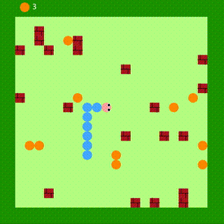
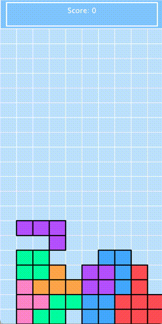
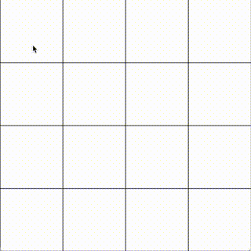

# Small Games

A collection of classic small games implemented in Java including Tetris, Snake, etc. Powered by [`StdDraw.java`](https://introcs.cs.princeton.edu/java/stdlib/javadoc/StdDraw.html)

## List of Games:
- Snake

- Tetris

- Memory Matching

